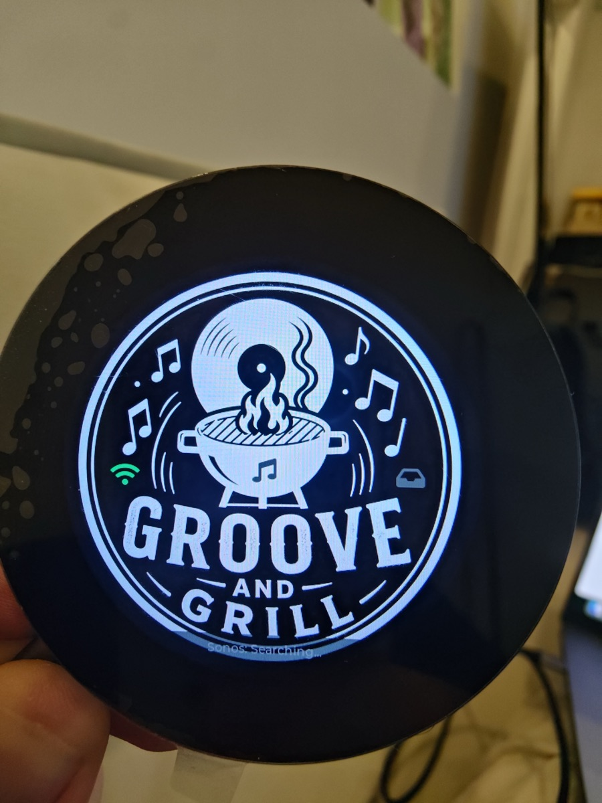
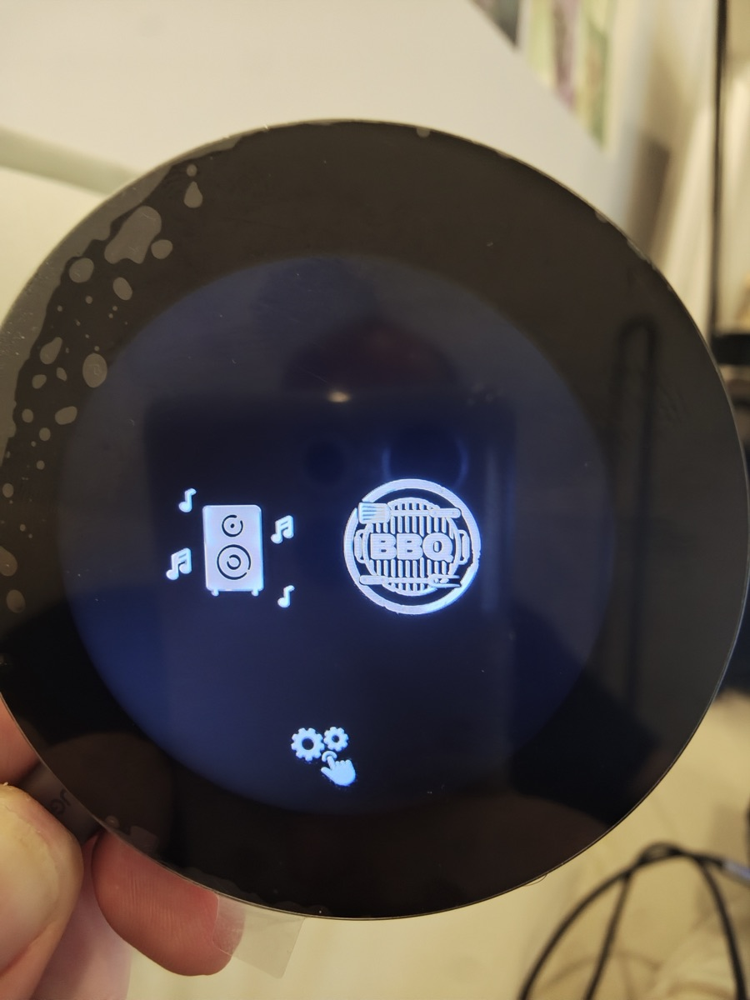
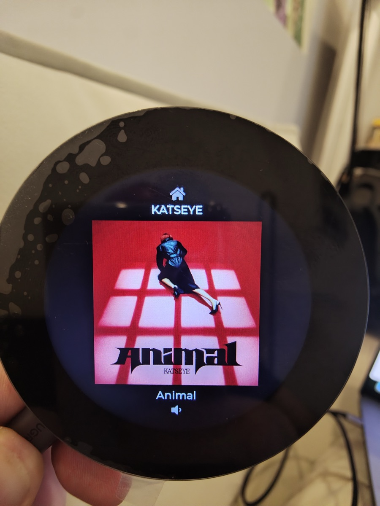
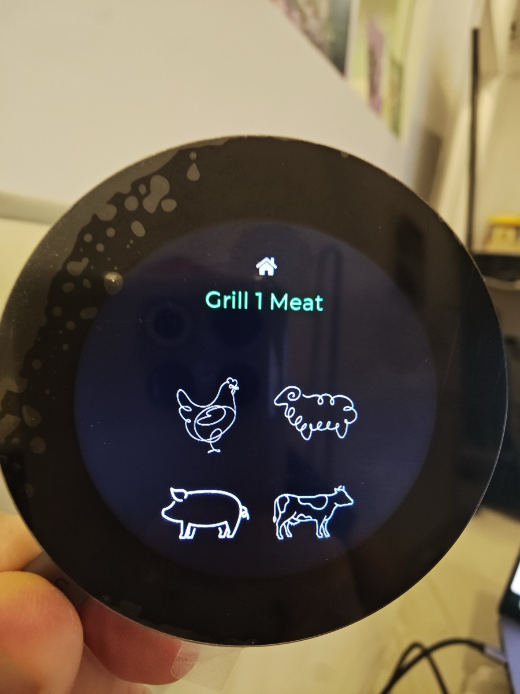
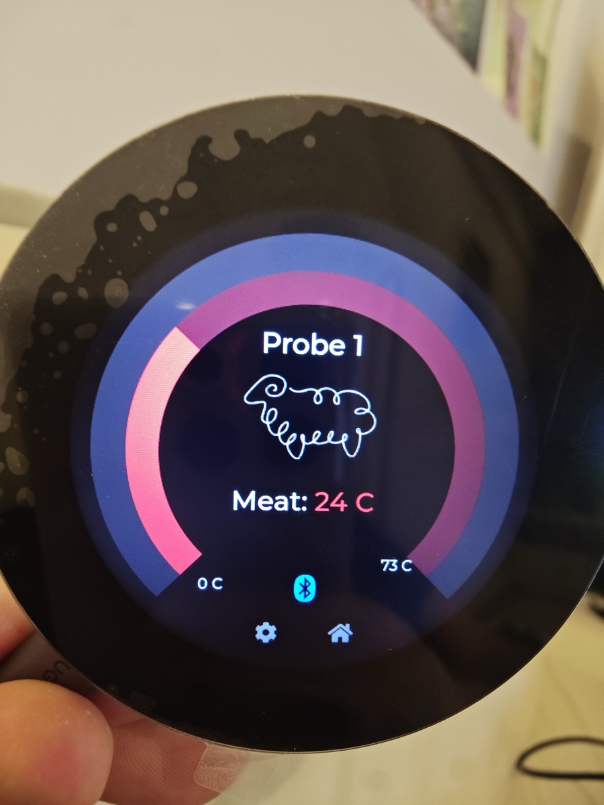
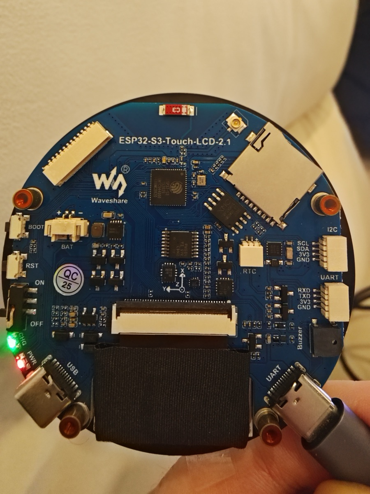

# Groove & Grill




[](LICENSE)

A combined **Sonos music controller** and **BBQ temperature monitor** for the
kitchen/patio, running on an ESP32-S3 with a 480×480 round touch display.

Control your Sonos system — browse and play favourites, skip tracks, adjust
volume — and keep an eye on multiple grills and cuts of meat with live gauges,
reading temperatures over Bluetooth from wired thermocouples and wireless
probes, either via a companion **BBQ Box** gateway or connected directly to
the display in standalone mode.

> Firmware version: **1.3.0** · Status: **active development**

---

## Contents
- [Screenshots](#screenshots)
- [Hardware](#hardware)
- [Getting started](#getting-started)
  - [🍖 Want to just use it?](#-want-to-just-use-it)
  - [🛠️ Want to tinker?](#️-want-to-tinker)
- [Using the device](#using-the-device)
- [BBQ monitoring](#bbq-monitoring)
- [Releasing a new version](#releasing-a-new-version)
- [Project layout](#project-layout)
- [Known issues](#known-issues)
- [Roadmap / to-do](#roadmap--to-do)
- [License](#license)
- [Credits](#credits)

---

## Screenshots

<table>
<tr>
<td align="center"><br>Main menu</td>
<td align="center"><br>Now playing</td>
<td align="center"><br>Meat picker</td>
<td align="center"><br>Live probe gauge</td>
</tr>
</table>

---

## Hardware

**Main unit** — [Waveshare ESP32-S3-Touch-LCD-2.1](assets/ReadmePictures/WaveshareAdvert.jpg)
(2.1″ round touch display board)



- **MCU:** ESP32-S3 (dual-core Xtensa LX7 @ 240 MHz)
- **PSRAM:** 8 MB octal · **Flash:** 16 MB (dual OTA slots + 2 MB SPIFFS art cache)
- **Display:** 480×480 round RGB LCD
- **Touch:** CST820 capacitive controller (I²C)
- **IO expander:** TCA9554 (shares the I²C bus; drives display/touch reset lines,
  and the onboard **buzzer** used for the BBQ lost-connection alarm)
- **Power:** mains-powered (USB-C)

**BBQ probes** — two supported sources, switchable in **Settings → BBQ Source**
(see [BBQ monitoring](#bbq-monitoring)):
- **BBQ Box** (recommended for multiple grills/meats) — the companion
  **[ESP BLE BBQ Box](https://github.com/CoopsInChina/ESP-BLE-BBQ-Box)** reads up
  to **4× Type-K thermocouples** (MAX31855) *and* connects to **2 wireless BLE
  probes**, broadcasting everything in one connectionless BLE advertisement; the
  display just passively **observes** it — no pairing, no per-probe cost on the
  display. Type-K covers Big Green Egg-class grill-ambient temperatures
  (fibreglass/mineral-insulated leads); food-grade stainless or wireless probes
  suit the meat.
- **Standalone wireless probes** (no Box needed) — the display connects
  **directly** as a BLE central to up to 2 wireless meat probes (a BLE
  thermometer using a NOTIFY-characteristic protocol). Good for a quick
  single- or dual-probe cook without setting up the Box.

---

## Getting started

### 🍖 Want to just use it?

No coding, no cables (after the first flash).

1. **Flash it.** Open **`https://coopsinchina.github.io/GrooveAndGrill/`** in
   Chrome or Edge on a desktop/laptop (needs [Web Serial](https://developer.chrome.com/docs/capabilities/serial),
   so not available on mobile), plug the board in over USB-C, and click
   **Install**. That's the whole install — bootloader, partition table, and
   app go on in one step, no software to download.
2. **Join it to your WiFi.** On first boot the device has no saved network, so
   it opens its own hotspot, **`GrooveGrillSetup`**. Join it from your phone or
   laptop and follow the QR code / URL shown on the display to enter your home
   network's WiFi details. The device reboots onto your network and starts
   looking for Sonos speakers automatically — no further setup needed there.
3. **Add your Favourites.** On the display, swipe to the Favourites carousel
   and tap the **"＋"** slot to bring up a QR code, or just browse to
   **`http://<device-ip>/setup`** from any device on the same network. From
   there you can add a Spotify link or playlist URL, or pull in your Sonos
   system's own built-in Favourites — they'll appear on the carousel right away.

From here, updates are wireless too — **Settings → OTA Update → Check for
Update** — no cable needed ever again.

### 🛠️ Want to tinker?

Building your own copy, changing the UI, or contributing back.

**Stack:** ESP-IDF 5.3.1 via **PlatformIO** (`espressif32@6.9.0`), **LVGL 8.3**
for the UI. Sonos playback goes straight to the speaker over UPnP SOAP
(`AddURIToQueue`/`SetAVTransportURI`) and pulls album art directly from
it — no external server required for the common case. An optional
[`node-sonos-http-api`](https://github.com/jishi/node-sonos-http-api) instance
on your LAN is auto-discovered and used only as a fallback for sources direct
SOAP doesn't cover (e.g. Apple Music) and for browsing Sonos's own built-in
Favorites.

1. **Clone it:**
   ```bash
   git clone https://github.com/CoopsInChina/GrooveAndGrill.git
   cd GrooveAndGrill
   ```
2. **Install VS Code + PlatformIO.** Get [VS Code](https://code.visualstudio.com/),
   then install the **PlatformIO IDE** extension from the Extensions panel.
   Open the cloned folder — PlatformIO reads `platformio.ini` and offers to
   install the pinned `espressif32@6.9.0` toolchain automatically; accept it.
3. **Build:**
   ```bash
   pio run                       # build
   pio run -t upload -t monitor  # flash over USB + open the serial monitor
   ```
   Nothing else to configure — WiFi and Sonos setup both happen at runtime on
   the device itself (see [Want to just use it?](#-want-to-just-use-it)
   above), not at build time.

   One thing worth knowing up front: PlatformIO generates `sdkconfig.music_meat`
   on your **first** build, seeded from `sdkconfig.defaults` — it's local to
   your machine and git-ignored, so you never create or commit it yourself.
   The gotcha: once an option exists in that generated file, editing
   `sdkconfig.defaults` alone won't change it on a machine that has already
   built — edit `sdkconfig.music_meat` directly, or delete it to regenerate
   fresh from defaults.

4. **Only if you're changing artwork or meat data** — the generated sources
   below are already committed and built from as-is, so you don't need to
   touch this unless you're editing their inputs:
   - `python3 scripts/gen_meat_temps.py` → `src/meat_temps.h` (from `data/meat_temps.json`)
   - `python3 scripts/gen_meat_icons.py` → `src/img_meat_icons.c` (from `assets/Meat Icons/`,
     which isn't in the repo — see [Credits](#credits))

---

## Using the device

Navigation is by **tap** and **swipe**, with a **home button** at the top of most
screens that returns to the main menu.

### Main menu
Tiles for **Music**, **BBQ**, and **Settings** (gear).

### Music screen
| Action | Result |
|---|---|
| Tap anywhere | Play / pause |
| Swipe up / down | Next / previous track |
| Swipe left | Go to Favourites |
| Volume button (bottom) | Open the Volume screen |
| Home button (top) | Return to menu |

Artist is shown above the album art, track title below it.

### Favourites
A smooth scroll-snap carousel of your saved favourites plus the "＋" (add) slot,
with rounded album art and an animated wrap at the ends.
- **Swipe left / right** to browse.
- **Tap** a favourite to play it.
- On the **＋ slot**, tap to show a QR code linking to the web setup page.
- Page dots at the bottom indicate position.

### Volume
- **Drag the arc** or **swipe up / down** to change volume (reads the speaker's
  actual level on entry).
- Auto-returns to the music screen after ~10 s of inactivity.

### Settings
Also a swipe carousel, with an animated wrap at the ends:
**WiFi · Speaker · BBQ Source · OTA Update · Screensaver · About**

OTA Update: shows the running version, *Check for Update* / *Update Now*
(manual only — see [Releasing a new version](#releasing-a-new-version)). A
successful update hands off to a 5-second reboot countdown screen.

### Screensaver
After a period of inactivity the display shows a **clock + weather** widget;
touch to wake. Dimming and screensaver timers are configurable in Settings.

### Diagnostics
Browse to **`http://<device-ip>/faultlog`** (also linked from the `/setup`
page's footer) for a plain-language history of every warning and error the
firmware has logged — it's written to flash as it happens, so it survives a
reboot or power loss and can be checked the morning after without a USB cable
having been attached overnight.

---

## BBQ monitoring

The model is **sensor-centric**: every sensor (a thermocouple or a wireless
probe) is allocated to a **grill number** and a **role** — grill-ambient or
meat — with its own target. Allocations are **saved to NVS**, so a cook
survives a reboot. A grill can carry several meats, each shown on its own
screen.

**Source mode — Settings → BBQ Source**
- **BBQ Box** (default): passive BLE observer of the companion Box's
  advertisement — thermocouples + up to 5 wireless probes it relays.
- **Wireless Probe**: the display connects directly, as a BLE central, to up
  to 2 wireless probes — no Box needed.
- Switching source reboots the device (different BLE roles need a fresh
  radio init) — a countdown screen confirms it, then it comes back up
  scanning in the new mode.

**On the display**
- The BBQ carousel is the same smooth scroll-snap swipe experience as
  Favourites/Settings, with **one gauge screen per meat** (labelled by grill
  number in Box mode, or by probe slot — "Probe 1"/"Probe 2" — in standalone
  mode), plus ambient-only screens and an **Add Meat** slot.
- Each screen shows **segmented tick-ring gauges** — outer ring = grill temp,
  inner ring = meat temp — filling toward their targets, with a centre meat
  icon and live/target readouts ("– C" until the sensor reports).
- **Add Meat wizard:** pick a sensor → (Box mode only) pick a grill and
  whether it's the grill-ambient or a meat probe → set the target (grill-temp
  slider, or meat kind + doneness). In standalone probe mode the grill/type
  steps are skipped — every probe is a meat. Meats: **Chicken / Lamb / Pork /
  Beef** — chicken uses a single food-safe target; the rest use a
  **doneness** slider whose targets come from `data/meat_temps.json`.
- **⚙ Config** on any screen re-opens that sensor's settings; a **🗑 delete**
  frees it. In standalone mode, a probe's slot (1/2) is bonded the first time
  it's seen and stays stable until you delete it — it won't shuffle around
  as probes connect/disconnect.
- **Lost-connection alarm:** if a sensor that was reporting stops (probe
  disconnects, box goes quiet), its ring flashes at the last known reading,
  the meat icon swaps to a warning icon, and the onboard **buzzer** sounds
  until it's resolved.
- The **Bluetooth icon** reflects the active link for that screen — blue when
  its sensor's source (the Box, or that specific probe) is being heard, dim
  when it's silent.

**On the web** — `http://<device-ip>/setup` (BBQ Setup tab)
- Live view **and** allocation for every sensor via **Grill # ▸ Type ▸ Meat ▸
  Target** dropdowns (meat targets use the same doneness table as the display).
- Shows the current source mode with a switch button (with a reboot warning).
- The web page and the on-screen config write the **same** NVS-backed model, so
  edits from either surface stay in sync.

---

## Releasing a new version

*This section is for maintainers cutting a build for distribution — if you
just want a device running the latest release, see
[Want to just use it?](#-want-to-just-use-it) instead.*

**Only builds pushed to the `release` branch are ever published.** Merging
`dev` → `release` (or pushing directly) triggers
[`.github/workflows/release.yml`](.github/workflows/release.yml), which builds
the firmware and publishes it to **GitHub Pages**:

| What | Where |
|---|---|
| Browser-based USB flash (no software install — Chrome/Edge, Web Serial) | `https://coopsinchina.github.io/GrooveAndGrill/` |
| Version the device checks against (Settings → OTA Update) | `.../version.json` |
| The app image itself | `.../firmware.bin` |

One-time repo setup: **Settings → Pages → Source → "GitHub Actions"**.

**Bump the version** before releasing — it's the single source of truth read
by both the firmware build and the release workflow:
```ini
# platformio.ini
build_flags =
    -DFIRMWARE_VERSION=\"X.Y.Z\"
```

**Installing:**
- **First-time / bare board:** open the Pages URL above on Chrome/Edge, plug
  in via USB-C, click Install. Flashes bootloader + partition table + app.
- **Already running Groove & Grill:** **Settings → OTA Update** → *Check for
  Update* → *Update Now*. Downloads `firmware.bin` into the inactive OTA slot
  over Wi-Fi and reboots — no cable needed. If the new image crashes before
  finishing boot, the bootloader automatically rolls back to the previous
  slot (`CONFIG_APP_ROLLBACK_ENABLE`).

**Verifying a release** — confirm the binaries CI published are genuinely
built from the commit `version.json` claims, not something stale or tampered:

1. `version.json` on Pages carries the exact commit: `{"version":"X.Y.Z",
   "file":"firmware.bin","commit":"<sha>"}`.
2. `sha256sums.txt` (same folder) has the published SHA-256 of each binary.
3. Builds are **reproducible** (`CONFIG_APP_REPRODUCIBLE_BUILD` — strips the
   compile timestamp, the only non-deterministic input for a fixed commit +
   pinned toolchain), so rebuilding that exact commit locally reproduces the
   same bytes:
   ```bash
   git checkout <sha>          # the commit named in version.json
   pio run -e music_meat
   shasum -a 256 .pio/build/music_meat/firmware.bin
   ```
   Compare against the matching line in `sha256sums.txt`. A match confirms
   CI built from that source with no tampering in between; a mismatch means
   either the toolchain drifted from the pinned `espressif32@6.9.0` or the
   published artifact doesn't match that commit.

---

## Project layout

```
src/
  main.c                 startup, task/UI bring-up
  ui_common.*            screen registry, navigation, gestures, home button
  ui_boot.c              boot / status screen
  ui_menu.c              main menu
  ui_sonos_main.c        now-playing / music screen
  ui_favourites.c        favourites carousel
  ui_volume.c            volume arc
  ui_settings.c          settings carousel (WiFi/Speaker/OTA/Screensaver/About)
  ui_bbq.c               cook-view carousel + segmented tick-ring gauges
  ui_bbq_add.c           "Add Meat" wizard (grill → sensor → type)
  ui_bbq_config.c        sensor config (grill target / meat select, delete)
  ui_bbq_doneness.c      doneness selection
  ui_widgets.c           clock + weather screensaver
  ui_reboot.*            shared "changing settings — rebooting in N" screen
  bbq_controller.*       sensor-centric BBQ model + NVS persistence
  bbq_ble.*              passive BLE observer of the BBQ Box advertisement
  ble_probe.*            direct multi-probe BLE central (standalone mode)
  app_log.*              [LEVEL] (TAG) (time) log format + flash-backed fault log
  ota_update.*           OTA check/download client (esp_https_ota)
  sonos_controller.c     Sonos discovery, polling, playback, favourites
  ui_art.c               album-art download / decode / cache
  cst820.c / tca9554.c   touch + IO-expander drivers
  buzzer.c               onboard buzzer (TCA9554 pin 8) — BBQ alarm
  web_server.c           /setup — tabbed Music Setup / BBQ Setup page + /faultlog
  img_*.c                generated image assets
data/meat_temps.json     meat doneness → target-temperature table (tracked)
scripts/                 codegen for meat data + icons
web/pages/index.html     GitHub Pages web-flash landing page (ESP Web Tools)
.github/workflows/       release.yml — builds `release` pushes, publishes Pages
docs/                    protocol notes (BLE box integration, Sonos direct playback)
assets/ReadmePictures/   photos used in this README
partitions.csv           16 MB flash layout (dual OTA + 2 MB SPIFFS art cache)
```

---

## Known issues

- **Boot-time graphical tear** on the first real screen after boot — root
  cause not yet isolated despite extensive testing; a short delay between
  early startup steps works around it in the meantime.
  ([#2](https://github.com/CoopsInChina/GrooveAndGrill/issues/2))
- **Rare LVGL heap-corruption crash** after long uptime — surfaces in an
  unrelated redraw path, pointing to an earlier out-of-bounds write
  elsewhere that hasn't been isolated yet.
  ([#1](https://github.com/CoopsInChina/GrooveAndGrill/issues/1))

---

## Roadmap / to-do

- **Box gateway wireless-probe bring-up:** a thread-safety bug in the Box's
  probe-connect path was fixed, but it hasn't been verified end-to-end on
  hardware yet — needs a real cook to confirm probes report correctly through
  the Box (standalone mode, where the display connects directly, is already
  confirmed working and doesn't depend on this).
- **OTA throughput:** downloads work (resumable via HTTP Range, survives a
  stall/retry) but have been slow on at least one network path — worth
  re-testing outside that network, and considering an alternate host (e.g.
  GitHub Releases) if it's consistently slow rather than link-specific.
- **Add Meat wizard polish:** tidy minor UI overlaps in the wizard step screens
  (low priority).
- **Cleanup:** prune the now-dead legacy grill shim in `bbq_controller.c`
  (`bbq_get_grill` / `bbq_set_targets` / `bbq_add_grill` / mock hooks).
- **Now-playing progress:** parse and display track progress on the music arc.
- **Memory:** screens are cached for the session and never freed, so the LVGL
  object pool only grows. Free unused screens (wire up `ui_screen_invalidate()`)
  or move the pool to PSRAM before adding many more screens.
- General testing and defect fixing across all features.

---

## License

[MIT](LICENSE) — covers the code in this repository. It does **not** cover
the original UI artwork (icons, boot image), which isn't included in the
repo in the first place — see [Credits](#credits) and
[Want to tinker?](#️-want-to-tinker).

## Credits

- Graphical assets by **AngryAngShanghai**.
- Built on an ESP32-S3 round-display platform, ESP-IDF, and LVGL.
